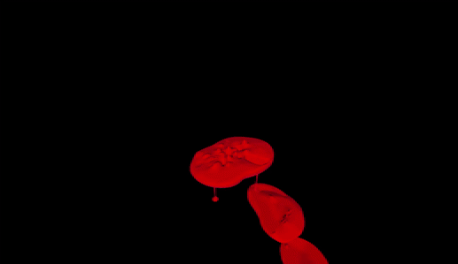
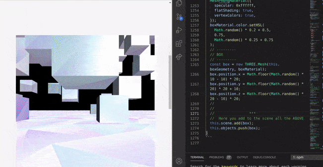

# First Person Control and PointerLockControls 👾👾👾

 <br>
  <br>
   <br>
    <br>

#### START by importing the code from the node modules, just like in the past tests:

```javascript
import { FirstPersonControls } from "three/examples/jsm/controls/FirstPersonControls";
```

<br>

##### preview of what you are importing (inside the link)

- ALSO... to understand a bit this code, check out the beginners app we created in class

[beginners commands videgame](https://github.com/nadiamariduena/first-game-dci/blob/master/src/scripts/moving-character.js)

```javascript
import * as THREE from "three";

THREE.FirstPersonControls = function (object, domElement) {
  if (domElement === undefined) {
    console.warn(
      'THREE.FirstPersonControls: The second parameter "domElement" is now mandatory.'
    );
    domElement = document;
  }

  this.object = object;
  this.domElement = domElement;

  // API

  this.enabled = true;

  this.movementSpeed = 1.0;
  this.lookSpeed = 0.005;

  this.lookVertical = true;
  this.autoForward = false;

  this.activeLook = true;

  this.heightSpeed = false;
  this.heightCoef = 1.0;
  this.heightMin = 0.0;
  this.heightMax = 1.0;

  this.constrainVertical = false;
  this.verticalMin = 0;
  this.verticalMax = Math.PI;

  this.mouseDragOn = false;

  // internals

  this.autoSpeedFactor = 0.0;

  this.mouseX = 0;
  this.mouseY = 0;

  this.moveForward = false;
  this.moveBackward = false;
  this.moveLeft = false;
  this.moveRight = false;

  this.viewHalfX = 0;
  this.viewHalfY = 0;

  // private variables

  var lat = 0;
  var lon = 0;

  var lookDirection = new THREE.Vector3();
  var spherical = new THREE.Spherical();
  var target = new THREE.Vector3();

  //

  if (this.domElement !== document) {
    this.domElement.setAttribute("tabindex", -1);
  }

  //

  this.handleResize = function () {
    if (this.domElement === document) {
      this.viewHalfX = window.innerWidth / 2;
      this.viewHalfY = window.innerHeight / 2;
    } else {
      this.viewHalfX = this.domElement.offsetWidth / 2;
      this.viewHalfY = this.domElement.offsetHeight / 2;
    }
  };

  this.onMouseDown = function (event) {
    if (this.domElement !== document) {
      this.domElement.focus();
    }

    event.preventDefault();
    event.stopPropagation();

    if (this.activeLook) {
      switch (event.button) {
        case 0:
          this.moveForward = true;
          break;
        case 2:
          this.moveBackward = true;
          break;
      }
    }

    this.mouseDragOn = true;
  };

  this.onMouseUp = function (event) {
    event.preventDefault();
    event.stopPropagation();

    if (this.activeLook) {
      switch (event.button) {
        case 0:
          this.moveForward = false;
          break;
        case 2:
          this.moveBackward = false;
          break;
      }
    }

    this.mouseDragOn = false;
  };

  this.onMouseMove = function (event) {
    if (this.domElement === document) {
      this.mouseX = event.pageX - this.viewHalfX;
      this.mouseY = event.pageY - this.viewHalfY;
    } else {
      this.mouseX = event.pageX - this.domElement.offsetLeft - this.viewHalfX;
      this.mouseY = event.pageY - this.domElement.offsetTop - this.viewHalfY;
    }
  };
  //
  //----------------------------
  //      commands
  //----------------------------
  //
  //
  this.onKeyDown = function (event) {
    //event.preventDefault();

    switch (event.code) {
      case "ArrowUp":
      case "KeyW":
        this.moveForward = true;
        break;

      case "ArrowLeft":
      case "KeyA":
        this.moveLeft = true;
        break;

      case "ArrowDown":
      case "KeyS":
        this.moveBackward = true;
        break;

      case "ArrowRight":
      case "KeyD":
        this.moveRight = true;
        break;

      case "KeyR":
        this.moveUp = true;
        break;
      case "KeyF":
        this.moveDown = true;
        break;
    }
  };
  //
  //
  //
  //

  this.onKeyUp = function (event) {
    switch (event.code) {
      case "ArrowUp":
      case "KeyW":
        this.moveForward = false;
        break;

      case "ArrowLeft":
      case "KeyA":
        this.moveLeft = false;
        break;

      case "ArrowDown":
      case "KeyS":
        this.moveBackward = false;
        break;

      case "ArrowRight":
      case "KeyD":
        this.moveRight = false;
        break;

      case "KeyR":
        this.moveUp = false;
        break;
      case "KeyF":
        this.moveDown = false;
        break;
    }
  };

  this.lookAt = function (x, y, z) {
    if (x.isVector3) {
      target.copy(x);
    } else {
      target.set(x, y, z);
    }

    this.object.lookAt(target);

    setOrientation(this);

    return this;
  };

  this.update = (function () {
    var targetPosition = new THREE.Vector3();

    return function update(delta) {
      if (this.enabled === false) return;

      if (this.heightSpeed) {
        var y = THREE.MathUtils.clamp(
          this.object.position.y,
          this.heightMin,
          this.heightMax
        );
        var heightDelta = y - this.heightMin;

        this.autoSpeedFactor = delta * (heightDelta * this.heightCoef);
      } else {
        this.autoSpeedFactor = 0.0;
      }

      var actualMoveSpeed = delta * this.movementSpeed;

      if (this.moveForward || (this.autoForward && !this.moveBackward))
        this.object.translateZ(-(actualMoveSpeed + this.autoSpeedFactor));
      if (this.moveBackward) this.object.translateZ(actualMoveSpeed);

      if (this.moveLeft) this.object.translateX(-actualMoveSpeed);
      if (this.moveRight) this.object.translateX(actualMoveSpeed);

      if (this.moveUp) this.object.translateY(actualMoveSpeed);
      if (this.moveDown) this.object.translateY(-actualMoveSpeed);

      var actualLookSpeed = delta * this.lookSpeed;

      if (!this.activeLook) {
        actualLookSpeed = 0;
      }

      var verticalLookRatio = 1;

      if (this.constrainVertical) {
        verticalLookRatio = Math.PI / (this.verticalMax - this.verticalMin);
      }

      lon -= this.mouseX * actualLookSpeed;
      if (this.lookVertical)
        lat -= this.mouseY * actualLookSpeed * verticalLookRatio;

      lat = Math.max(-85, Math.min(85, lat));

      var phi = THREE.MathUtils.degToRad(90 - lat);
      var theta = THREE.MathUtils.degToRad(lon);

      if (this.constrainVertical) {
        phi = THREE.MathUtils.mapLinear(
          phi,
          0,
          Math.PI,
          this.verticalMin,
          this.verticalMax
        );
      }

      var position = this.object.position;

      targetPosition.setFromSphericalCoords(1, phi, theta).add(position);

      this.object.lookAt(targetPosition);
    };
  })();

  function contextmenu(event) {
    event.preventDefault();
  }
  /*


                        DISPOSE method ?

                        The dispose is related to the Memory life Cycle


                        When the DocumentViewer is disposed, it will call the dispose methods of all its parts (View, Thumbnails, Bookmarks, Text and Annotations).

Disposing a document viewer will first clear the current document by using SetDocument(null), this will abort all workers and wait for them to exit gracefully. Hence, a slight delay might happen when calling this method.

When the document viewer is disposed, it will also delete all the UI controls created and remove them from their parent containers.

https://www.leadtools.com/help/sdk/v20/dh/javascript/doxui/documentviewer-dispose.html


*/
  this.dispose = function () {
    this.domElement.removeEventListener("contextmenu", contextmenu);
    this.domElement.removeEventListener("mousedown", _onMouseDown);
    this.domElement.removeEventListener("mousemove", _onMouseMove);
    this.domElement.removeEventListener("mouseup", _onMouseUp);

    window.removeEventListener("keydown", _onKeyDown);
    window.removeEventListener("keyup", _onKeyUp);
  };

  var _onMouseMove = bind(this, this.onMouseMove);
  var _onMouseDown = bind(this, this.onMouseDown);
  var _onMouseUp = bind(this, this.onMouseUp);
  var _onKeyDown = bind(this, this.onKeyDown);
  var _onKeyUp = bind(this, this.onKeyUp);

  this.domElement.addEventListener("contextmenu", contextmenu);
  this.domElement.addEventListener("mousemove", _onMouseMove);
  this.domElement.addEventListener("mousedown", _onMouseDown);
  this.domElement.addEventListener("mouseup", _onMouseUp);

  window.addEventListener("keydown", _onKeyDown);
  window.addEventListener("keyup", _onKeyUp);

  function bind(scope, fn) {
    return function () {
      fn.apply(scope, arguments);
    };
  }

  function setOrientation(controls) {
    var quaternion = controls.object.quaternion;

    lookDirection.set(0, 0, -10).applyQuaternion(quaternion);
    spherical.setFromVector3(lookDirection);

    lat = 90 - THREE.MathUtils.radToDeg(spherical.phi);
    lon = THREE.MathUtils.radToDeg(spherical.theta);
  }

  this.handleResize();

  setOrientation(this);
};
```

<br>
<br>
<br>

#### COMMON ERROR

- Since I had no idea how to start with this, I presumed I could simply import the folders from the node modules like I did before, but after watching the tutorial I realized it wasn't required.

##### the error

```javascript
    ./src/components/3dScenes/TropicFirstPerson.js
Attempted import error: 'FirstPersonControls' is not exported from 'three' (imported as 'THREE').

```

<br>

##### the solution

```javascript
//
// instead of this:
this.cameraControlsFirstPerson = new THREE.FirstPersonControls();
//
//
//
//
//add this: (remove the THREE)

this.cameraControlsFirstPerson = new FirstPersonControls();
```

  <br>
  <br>

# 🌵

#### NOW REPLACE the old settings from the the purple rain camera for the following:

```javascript
this.camera.position.x = 40;
this.camera.position.y = 40;
this.camera.position.z = 40; // origin: 50
//
this.camera.lookAt(this.scene.position); //we are looking at the center of the scene(depends of what yoou have in the camera position)
```

   <br>
    <br>

### HIDE the old Orbits controls and the zoom distance

```javascript
this.cameraControlsFirstPerson = new FirstPersonControls(
  this.camera,
  this.eleModelBlOne
);

this.cameraControlsFirstPerson.lookSpeed = 0.05;
this.cameraControlsFirstPerson.movementSpeed = 10;
//

//
//
//-------------- before the first person controls , we had this:
// OrbitControls allow a camera to orbit around the object
// https://threejs.org/docs/#examples/controls/OrbitControls
// this.controls = new OrbitControls(this.camera, this.eleModelBlOne);
//  ------------- **
//
//
//
//  to limit zoom distance so that the User
//  dont zoom out of the specified range

// this.controls.maxDistance = 70;
```

##### DELETE most of the models (leave just 1)

<br>
<br>

### Now add the delta to make it work

- I still dont get what is the concrete logic of the delta, i know that here it s updating something and causing a loop like, but I am confused about the "why " of its use.I just know that if you use the delta with the clock, your animation will never stop from doing what you told it to do, ex: if you want an object to move from top to bottom without ending and with a certain tempo, it will do it.

```javascript
//
    //
    // ------------------ clock
    this.stop = 0;
    this.stepy = 0;
    this.clock = new THREE.Clock();

    //
    //
    //
  };

  // 3
  startAnimationLoop = () => {
    this.stop += 0.005;
    this.stepy += 0.00005;
    this.delta = this.clock.getDelta();
    //
    //
    this.cameraControlsFirstPerson.update(this.delta);
    //
    this.renderer.render(this.scene, this.camera);
    this.requestID = window.requestAnimationFrame(this.startAnimationLoop);
  };
  /*


```

### First result

- Here (in the image) I am clicking to get near the red object.

- to turn, i just have to mouse over the direction i want.

- but its not nice to test it on this object, tomorrow i will create another model where it will be much more easier to check the progress.

[]()

<br>
<br>
<br>

### FIGURING a way to prevent the camera going up and down like so:

- I found out you can **change** the following **inside the node modules:**

[]()

```javascript
// API

//*******  here **********
//
// this will prevent the camera from looking up and down
this.lookVertical = true; //
// type npm start again, as refreshing will no update the changes
//
```

<br>
<br>
<br>

#### I WILL TRY another code that seems to me more of a (beginner level) than the one i am trying, so this code below is the code i ve been studying until now:

```javascript
import React, { Component } from "react";
import * as THREE from "three";
//
// import { OrbitControls } from "three/examples/jsm/controls/OrbitControls";
import { FirstPersonControls } from "three/examples/jsm/controls/FirstPersonControls";
// import { FirstPersonControls } from "firstpersoncontrols.js";
//
//

import { GLTFLoader } from "three/examples/jsm/loaders/GLTFLoader";
import { DRACOLoader } from "three/examples/jsm/loaders/DRACOLoader";

//
//

const style = {
  height: 600, // we can control scene size by setting container dimensions
};
//

//
//
class TropicalVoid extends Component {
  componentDidMount() {
    this.sceneSetup();
    this.addCustomSceneObjects();
    this.startAnimationLoop();

    //
    window.addEventListener("resize", this.handleWindowResize);
  }
  //
  //
  componentWillUnmount() {
    window.removeEventListener("resize", this.handleWindowResize);
    window.cancelAnimationFrame(this.requestID);
    // right now with the first person control,
    // we dont need this dispose as it s already included inside the three folder, check the read me, in the
    // beginning you will find a copy of the code inside the threejs that I am using.
    // this.controls.dispose();
  }
  /*


  */
  // 1
  sceneSetup = () => {
    // background color scene
    // this.lemonChiffon = "rgb(240, 224, 190)";

    const width = this.eleModelBlOne.clientWidth;
    const height = this.eleModelBlOne.clientHeight;
    //

    this.scene = new THREE.Scene();
    //
    //
    this.camera = new THREE.PerspectiveCamera(
      55, // fov = field of view
      width / height, // aspect ratio
      1, // near plane
      30000 // far plane
    );
    /*
    
    
    original
    
    this.camera = new THREE.PerspectiveCamera(
      //
      25, // fov = field of view
      width / height, // aspect ratio
      0.1, // near plane
      1000 // far plane
    );
    
    
    
    
    
    
    
    
    */
    //----------------------------------
    //           AXES HELPER
    //----------------------------------
    // This block of code is just to help you to see where you are at in the scene
    // if i add the this.axes, it s going to clash with the dispose inside the
    //
    // const axes = new THREE.AxesHelper(50); //origin 50
    // this.scene.add(axes);
    //
    this.camera.position.x = 12;
    this.camera.position.y = 0;
    this.camera.position.z = 0; // origin: 50
    //
    this.camera.lookAt(this.scene.position); //we are looking at the center of the scene(depends of what yoou have in the camera position)

    //
    //
    this.renderer = new THREE.WebGL1Renderer({
      // set the transparency of the scene, otherwise its black
      // alpha: true,
      // will make the edges smooth
      antialias: true,
    });
    //
    //
    //

    //

    //
    //
    // *************************************
    //
    //
    //-------------- before the first person controls , we had this:
    // OrbitControls allow a camera to orbit around the object
    // https://threejs.org/docs/#examples/controls/OrbitControls
    // this.controls = new OrbitControls(this.camera, this.eleModelBlOne);
    //  ------------- **
    //
    //
    //
    //  to limit zoom distance so that the User
    //  dont zoom out of the specified range

    // this.controls.maxDistance = 70;

    //
    //
    //
    this.renderer.setSize(width, height);
    // BG color from the scene
    // this.renderer.setClearColor(this.lemonChiffon);
    this.renderer.shadowMap.enabled = true;
    // here you append it to the jsx
    this.eleModelBlOne.appendChild(this.renderer.domElement); // mount using React ref

    this.cameraControlsFirstPerson = new FirstPersonControls(
      this.camera,
      this.eleModelBlOne
    );
    // ------------ with this 2 lines , the camera will move really fast, its better to hide it while testing it
    this.cameraControlsFirstPerson.lookSpeed = 0.05; // the speed when you move (without clicking)
    // lookSpeed = 0.02; slow
    // lookSpeed = 1; extremely fast
    this.cameraControlsFirstPerson.movementSpeed = 8; //the speed when you click

    // this.cameraControlsFirstPerson.maxPolarAngle = Math.PI / 2;

    //
    //
    //
    //
  };
  //
  //
  //
  //

  /*


  */
  // 2
  addCustomSceneObjects = () => {
    //----------------------------------
    //         BLENDER  MODELS
    //----------------------------------
    //
    const loader = new GLTFLoader();
    const dracoLoader = new DRACOLoader();
    dracoLoader.setDecoderPath("myDecoder/");
    loader.setDRACOLoader(dracoLoader);

    //
    // terrain_grosso_moon.-Normalize-4_.glb
    // 49,4Kb
    loader.load("./models/palmera-sun-palmeras2_retoucheeeggg.glb", (gltf) => {
      this.meshy = gltf.scene;

      gltf.scene.traverse((model) => {
        if (model.material) model.material.metalness = 0.08;

        model.receiveShadow = true;
        model.scale.set(2, 2, 2);
        // model.rotation.y = 1;
        // model.rotation.x += -0;
        // model.rotation.y += 0;
        //
        model.position.x = 0;
        model.position.y = -0.4;
        model.position.z = 0;
        //
        //
        //
      });

      this.scene.add(gltf.scene);
    });
    //
    // Add PLANE  w , h , segments
    const planeGeometry = new THREE.PlaneGeometry(500, 500, 100, 55);
    const planeMaterial = new THREE.MeshLambertMaterial({
      color: 0xdddddd,
      wireframe: true,
    });
    // var planeMaterial = new THREE.MeshLambertMaterial((color: 0xff0000));
    this.plane = new THREE.Mesh(planeGeometry, planeMaterial);
    //
    this.plane.rotation.x = -0.5 * Math.PI;
    this.plane.position.y = -1;
    //
    //
    // *** RECEIVE SHADOW
    // related to the light and the shadow
    this.plane.receiveShadow = true;
    this.scene.add(this.plane);
    //
    //
    // var box = new THREE.Box3();
    // box.setFromObject(this.plane);
    // //
    // //
    // if (this.camera.position.x > box.max.x) {
    //   this.camera.position.x = box.max.x;
    // }

    // if (this.camera.position.x < box.min.x) {
    //   this.camera.position.x = box.max.x;
    // }

    // if (this.camera.position.z > box.max.z) {
    //   this.camera.position.z = box.max.z;
    // }

    // if (this.camera.position.z < box.min.z) {
    //   this.camera.position.z = box.max.z;
    // }

    /*
    
    
    
    
    
    
    */
    //---------------------
    //   Directional Light
    //---------------------
    //
    // //
    this.renderer.outputEncoding = THREE.sRGBEncoding;
    this.renderer.shadowMap.enabled = true;
    this.renderer.shadowMap.autoUpdate = true;
    this.renderer.gammaFactor = 2.2;

    const directionalLight = new THREE.DirectionalLight(0xffffff);
    directionalLight.position.set(5, -1, 100);

    // position as follow , the light comes from x:-1000, comes from: y and the last comes from : z
    directionalLight.position.set(1000, 1000, 1000);
    directionalLight.castShadow = true;
    directionalLight.shadow.camera = new THREE.OrthographicCamera(
      -100,
      200,
      -200,
      200,
      0.5,
      5000
    );
    // //
    this.scene.add(directionalLight);
    // The light points to the flat ground
    // this.directionalLight.target = this.plane;  //dont add this
    //
    //
    //THIS LIGHT IS ON THE BOTTOM
    //---------------------
    //     spotLight FF5733
    //---------------------
    //
    //
    //
    //
    // With the light you can see the colors you added to each geometry in the materials
    this.spotLight = new THREE.SpotLight(0xffffff, 0.5); //intensity:   0.5);
    // spotLight.position.set( 0 , 10 , 0 );
    this.spotLight.position.set(5, -50, 0); //x, y , z   original (5, -50, 0);
    // (2, 32, 32); with this settings the light will be on the front
    this.spotLight.castShadow = true;
    //
    // this will remove the shadows
    this.spotLight.visible = true;
    //
    this.scene.add(this.spotLight);
    // //
    //

    /*


 
 */
    //
    //
    // ------------------ clock
    this.stop = 0;
    this.stepy = 0;

    this.clock = new THREE.Clock();

    //
    //
    //
  };

  // 3
  startAnimationLoop = () => {
    this.stop += 0.005;

    this.stepy += 0.00005;
    this.delta = this.clock.getDelta();
    //
    //
    this.cameraControlsFirstPerson.update(this.delta);
    //
    this.renderer.render(this.scene, this.camera);
    this.requestID = window.requestAnimationFrame(this.startAnimationLoop);
  };
  /*


  */
  handleWindowResize = () => {
    const width = this.eleModelBlOne.clientWidth;
    const height = this.eleModelBlOne.clientHeight;
    //
    // updated renderer
    this.renderer.setSize(width, height);
    // updated **camera** aspect ratio
    this.camera.aspect = width / height;
    // That is the Three.js optimization: you can group multiple camera changes into a block with only one
    this.camera.updateProjectionMatrix();
  };
  /*


  */
  render() {
    return (
      <div className="scene-oblivion">
        <div
          className="modelBleOne"
          style={style}
          ref={(ref) => (this.eleModelBlOne = ref)}
        ></div>
      </div>
    );
  }
}

export default TropicalVoid;
```

<br>
<br>
<br>

# 🦄

# THE NEW CODE

- I FOUND this example while i was looking for solutions related to the DRACO converter, what i like is the possibility of jump into the objects :) 🏃

<br>
<br>

##### I TRIED TO ADD THE BLOCKER but it didnt work because I am trying to add an event listener to threejs "the scene" , it would have been easy to just have some div to make the connection to but for now i prefer to pass

- So this is the code that didnt work, it serves to add the overlay of the scene, where you explain the commands before playing

```javascript
this.blocker = document.getElementById("blocker");
this.instructions = document.getElementById("instructions");

this.instructions.addEventListener("click", (e) => {
  this.controls.lock();
});

this.controls.addEventListener("lock", (e) => {
  this.instructions.style.display = "none";
  this.blocker.style.display = "none";
});

this.controls.addEventListener("unlock", (e) => {
  this.blocker.style.display = "block";
  this.instructions.style.display = "";
});

this.scene.add(this.controls.getObject());
//
//
//
```

#### THE STYLES connected to it

```scss
//  THE STYLES connected to it
#blocker {
  position: absolute;
  width: 100%;
  height: 100%;
  background-color: rgba(0, 0, 0, 0.5);
}

#instructions {
  width: 100%;
  height: 100%;

  display: -webkit-box;
  display: -moz-box;
  display: box;

  -webkit-box-orient: horizontal;
  -moz-box-orient: horizontal;
  box-orient: horizontal;

  -webkit-box-pack: center;
  -moz-box-pack: center;
  box-pack: center;

  -webkit-box-align: center;
  -moz-box-align: center;
  box-align: center;

  color: #ffffff;
  text-align: center;
  font-family: Arial;
  font-size: 14px;
  line-height: 24px;

  cursor: pointer;
}
// https: ; //linguinecode.com/post/react-onclick-event-vs-js-addeventlistener
```

<br>
<br>

#### EXAMPLE of what i had in mind , but we cannot do it in this one

- I used this approach for the dropdown menu

[event listener react - dropdown GSAP menu](https://github.com/nadiamariduena/nadiamariduena-portfolio/blob/master/src/components/navbar/Navigation.js)

```javascript
class App extends React.Component {
  handleClick = () => console.log("Hi there");

  render() {
    return <button onClick={this.handleClick}>Say something</button>;
  }
}
```

<br>
<br>

# 🦕

#### LETS CONTINUE ... I will check it later

- LETS CONTINUE with the game commands (to see if it works)

<br>

- I DECIDED to try this code just because of the jump :)

[](https://youtu.be/5EqWN4fT79s)

<br>

```javascript
const onKeyDown = function (event) {
  switch (event.code) {
    case "ArrowUp":
    case "KeyW":
      moveForward = true;
      break;

    case "ArrowLeft":
    case "KeyA":
      moveLeft = true;
      break;

    case "ArrowDown":
    case "KeyS":
      moveBackward = true;
      break;

    case "ArrowRight":
    case "KeyD":
      moveRight = true;
      break;

    //  ---------
    //  JUMP
    //  ---------
    case "Space":
      if (canJump === true) velocity.y += 350;
      canJump = false;
      break;
  }
};

const onKeyUp = function (event) {
  switch (event.code) {
    case "ArrowUp":
    case "KeyW":
      moveForward = false;
      break;

    case "ArrowLeft":
    case "KeyA":
      moveLeft = false;
      break;

    case "ArrowDown":
    case "KeyS":
      moveBackward = false;
      break;

    case "ArrowRight":
    case "KeyD":
      moveRight = false;
      break;
  }
};
```

#### UNTIL NOW _no_ ERRORS just a WARNING

```javascript
  Line 117:7:  Expected a default case                default-case
  Line 149:7:  Expected a default case                default-case
  //
  117       switch (event.code) {
    149    switch (event.code) {
    //
    //
    //
  // READ MORE:
  // https://stackoverflow.com/questions/56084810/using-break-after-default-in-switch-statement-when-default-not-at-end
  //
// https://github.com/immerjs/immer/issues/91
```

[]()

<br>
<br>
<br>

# 🦏

## FLOOR GEOMETRY

- I think it s interesting to rediscover the uses of **Math random for geometries**

```javascript
// ---------------
// floor Geometry
// ---------------

this.floorGeometry = new THREE.PlaneGeometry(2000, 2000, 100, 100);
this.floorGeometry.rotateX(-Math.PI / 2);
//
//-------------------
// vertex displacement
//-------------------
//
let position = this.floorGeometry.attributes.position;
//
for (let i = 0, l = position.count; i < l; i++) {
  this.vertex.fromBufferAttribute(position, i);
  this.vertex.x += Math.random() * 20 - 10;
  this.vertex.y += Math.random() * 2;
  this.vertex.z += Math.random() * 20 - 10;
  position.setXYZ(i, this.vertex.x, this.vertex.y, this.vertex.z);
}
// ensure each face has unique vertices
this.floorGeometry = this.floorGeometry.toNonIndexed();
//
position = this.floorGeometry.attributes.position;
```

<br>
<br>

# 🦄

## FLOOR COLORS

- I must to tell, I ve never use colors in such way.

```javascript
//--------------
// colorsFloor
//--------------
const colorsFloor = [];
//
// what makes the triangles of the floor have different colors
for (let i = 0, l = position.count; i < l; i++) {
  // here you are generating random colors HSL
  // color.setHSL( .74, .64, .59 );
  // https://stackoverflow.com/questions/39596997/has-threejs-sethsl-been-depreciated
  //
  this.color.setHSL(
    Math.random() * 0.3 + 0.5,
    0.75,
    Math.random() * 0.25 + 0.75
  );
  colorsFloor.push(this.color.r, this.color.g, this.color.b);
}
//
this.floorGeometry.setAttribute(
  "color",
  new THREE.Float32BufferAttribute(colorsFloor, 3)
);
//
//
this.floorMaterial = new THREE.MeshBasicMaterial({ vertexColors: true });
//
```

<br>

#### Add the floor vertex and the floor colors = floor, to the scene

```javascript
//
//  Here you add to the scene all the ABOVE
// the floor represents = this.floorGeometry, this.floorMaterial
this.floor = new THREE.Mesh(this.floorGeometry, this.floorMaterial);
this.scene.add(this.floor);
```

[]()

<br>
<br>
<br>

# 🦒

## OBJECTS

- I was asking myself about **.toNonIndexed** , apparently it **creates a normal Geometry** and turn it into a **non-indexed** geometry. **Each face has now unique vertices.**

```javascript
// objects
// ensure each face has unique vertices
this.boxGeometry = new THREE.BoxGeometry(20, 20, 20).toNonIndexed();
// https://stackoverflow.com/questions/49609220/threejs-creating-a-grid-from-triangles
```

<br>

### WHAT IS vertexColors?

- The vertexColors **push a colour per vertex**

[assign different colors to each vertex in a geometry](https://stackoverflow.com/questions/10330342/threejs-assign-different-colors-to-each-vertex-in-a-geometry)

<br>

```javascript
//
// ---------
// BOXES GEOMETRY
// ---------
// .toNonIndexed();  ensure each face has unique vertices
this.boxGeometry = new THREE.BoxGeometry(20, 20, 20).toNonIndexed();
//
position = this.boxGeometry.attributes.position;
//--------------
// colors Box
//--------------
const colorsBox = [];
//
for (let i = 0, l = position.count; i < l; i++) {
  this.color.setHSL(
    Math.random() * 0.3 + 0.5,
    0.75,
    Math.random() * 0.25 + 0.75
  );
  colorsBox.push(this.color.r, this.color.g, this.color.b);
}
//
this.boxGeometry.setAttribute(
  "color",
  new THREE.Float32BufferAttribute(colorsBox, 3)
);
//
// the 500 correspond to the amount of boxes
// the material is MeshPhong, apparently its a good material to cast shadows
for (let i = 0; i < 500; i++) {
  const boxMaterial = new THREE.MeshPhongMaterial({
    specular: 0xffffff,
    flatShading: true,
    vertexColors: true,
  });
  boxMaterial.color.setHSL(
    Math.random() * 0.2 + 0.5,
    0.75,
    Math.random() * 0.25 + 0.75
  );
  // ---------
  // BOX
  // ---------
  const box = new THREE.Mesh(this.boxGeometry, boxMaterial);
  box.position.x = Math.floor(Math.random() * 10 - 10) * 20;
  box.position.y = Math.floor(Math.random() * 20) * 20 + 10;
  box.position.z = Math.floor(Math.random() * 20 - 10) * 20;
  //
  //
  //                ***
  //  Here you add to the scene all the ABOVE
  this.scene.add(box);
  this.objects.push(box);
}
```

[]()

<br>
<br>
<br>
<br>
<br>
<br>

# 🌴

## PointerLockControls _not working_

##### the code

```javascript
import React, { Component } from "react";
import * as THREE from "three";
import { PointerLockControls } from "three/examples/jsm/controls/PointerLockControls";

//
//
const style = {
  height: 600, // we can control scene size by setting container dimensions
};
let raycaster;
/*


  */
class TropicalVoid extends Component {
  componentDidMount() {
    this.sceneSetup();
    this.addCustomSceneObjects();
    this.startAnimationLoop();
    //
    window.addEventListener("resize", this.handleWindowResize);
  }
  //
  //
  componentWillUnmount() {
    window.removeEventListener("resize", this.handleWindowResize);
    window.cancelAnimationFrame(this.requestID);
    // right now with the first person control,
    // we dont need this dispose as it s already included inside the three folder, check the read me, in the
    // beginning you will find a copy of the code inside the threejs that I am using.
    this.controls.dispose();
  }
  /*


  */
  // 1
  sceneSetup = () => {
    // background color scene
    // this.lemonChiffon = "rgb(240, 224, 190)";

    const width = this.eleModelBlOne.clientWidth;
    const height = this.eleModelBlOne.clientHeight;
    //
    this.scene = new THREE.Scene();
    // this.scene.background = new THREE.Color(0xffffff);
    this.camera = new THREE.PerspectiveCamera(
      75,
      window.innerWidth / window.innerHeight,
      1,
      1000
    );
    this.camera.position.y = 10;

    //

    //
    this.renderer = new THREE.WebGL1Renderer({
      // set the transparency of the scene, otherwise its black
      // alpha: true,
      // will make the edges smooth
      antialias: true,
    });
    //
    //
    //

    //
    //renderer.setPixelRatio( window.devicePixelRatio );
    this.renderer.setSize(width, height);
    // BG color from the scene
    // this.renderer.setClearColor(this.lemonChiffon);
    this.renderer.shadowMap.enabled = true;
    // here you append it to the jsx
    this.eleModelBlOne.appendChild(this.renderer.domElement); // mount using React ref
    // test
    this.blocker.appendChild(this.renderer.domElement);
    //
    //
    //
    //
    //
    //----------------
    this.objects = [];
    //----------------
    //

    this.moveForward = false;
    this.moveBackward = false;
    this.moveLeft = false;
    this.moveRight = false;
    this.canJump = false;

    this.prevTime = performance.now();
    this.velocity = new THREE.Vector3();
    this.direction = new THREE.Vector3();
    this.vertex = new THREE.Vector3();
    this.color = new THREE.Color();

    //---------------------------
    //     PointerLockControl
    //---------------------------
    this.controls = new PointerLockControls(this.camera, this.eleModelBlOne);
    //
    //
    // If i change this to a function () {} it will give me an error
    this.eleModelBlOne.addEventListener("click", () => {
      this.controls.lock();
    });
    //
    this.controls.addEventListener("lock", () => {
      this.eleModelBlOne.style.display = "none";
      this.blocker.style.display = "none";
    });
    //
    this.controls.addEventListener("unlock", () => {
      this.blocker.style.display = "block";
      this.eleModelBlOne.style.display = "";
    });
    // //
    this.scene.add(this.controls.getObject());
    //
    //
    //
    //-------------------------------
    //             KEYS
    //-------------------------------
    //
    //
    const onKeyDown = function (event) {
      switch (event.code) {
        case "ArrowUp":
        case "KeyW":
          this.moveForward = true;
          break;

        case "ArrowLeft":
        case "KeyA":
          this.moveLeft = true;
          break;

        case "ArrowDown":
        case "KeyS":
          this.moveBackward = true;
          break;

        case "ArrowRight":
        case "KeyD":
          this.moveRight = true;
          break;

        //  ---------
        //  JUMP
        //  ---------
        case "Space":
          if (this.canJump === true) this.velocity.y += 350;
          this.canJump = false;
          break;
      }
    };

    const onKeyUp = function (event) {
      switch (event.code) {
        case "ArrowUp":
        case "KeyW":
          this.moveForward = false;
          break;

        case "ArrowLeft":
        case "KeyA":
          this.moveLeft = false;
          break;

        case "ArrowDown":
        case "KeyS":
          this.moveBackward = false;
          break;

        case "ArrowRight":
        case "KeyD":
          this.moveRight = false;
          break;
      }
    };
    //
    //
    this.eleModelBlOne.addEventListener("keydown", onKeyDown);
    this.eleModelBlOne.addEventListener("keyup", onKeyUp);
    //

    //
    raycaster = new THREE.Raycaster(
      new THREE.Vector3(),
      new THREE.Vector3(0, -1, 0),
      0,
      10
    );
    //
    //
    //
    //
  };
  //

  /*


  */
  // 2
  addCustomSceneObjects = () => {
    //-------------------------------
    //
    //
    // ---------------
    // floor Geometry
    // ---------------

    this.floorGeometry = new THREE.PlaneGeometry(2000, 2000, 100, 100);
    this.floorGeometry.rotateX(-Math.PI / 2);
    //
    //-------------------
    // vertex displacement
    //-------------------
    //
    let position = this.floorGeometry.attributes.position;
    //
    for (let i = 0, l = position.count; i < l; i++) {
      this.vertex.fromBufferAttribute(position, i);
      this.vertex.x += Math.random() * 20 - 10;
      this.vertex.y += Math.random() * 2;
      this.vertex.z += Math.random() * 20 - 10;
      position.setXYZ(i, this.vertex.x, this.vertex.y, this.vertex.z);
    }
    // ensure each face has unique vertices  **
    this.floorGeometry = this.floorGeometry.toNonIndexed();
    //
    position = this.floorGeometry.attributes.position;
    //
    //--------------
    // colorsFloor
    //--------------
    const colorsFloor = [];
    //
    // what makes the triangles of the floor have different colors
    for (let i = 0, l = position.count; i < l; i++) {
      // here you are generating random colors HSL
      this.color.setHSL(
        Math.random() * 0.3 + 0.5,
        0.75,
        Math.random() * 0.25 + 0.75
      );
      colorsFloor.push(this.color.r, this.color.g, this.color.b);
    }
    //
    this.floorGeometry.setAttribute(
      "color",
      new THREE.Float32BufferAttribute(colorsFloor, 3)
    );
    //
    //
    this.floorMaterial = new THREE.MeshBasicMaterial({ vertexColors: true });
    //
    //
    // ------------ Here you add to the scene all the ABOVE -----
    this.floor = new THREE.Mesh(this.floorGeometry, this.floorMaterial);
    this.scene.add(this.floor);
    //
    //
    // ---------
    // BOXES GEOMETRY
    // ---------
    // .toNonIndexed();  ensure each face has unique vertices
    this.boxGeometry = new THREE.BoxGeometry(20, 20, 20).toNonIndexed();
    //
    position = this.boxGeometry.attributes.position;
    //--------------
    // colors Box
    //--------------
    const colorsBox = [];
    //
    for (let i = 0, l = position.count; i < l; i++) {
      this.color.setHSL(
        Math.random() * 0.3 + 0.5,
        0.75,
        Math.random() * 0.25 + 0.75
      );
      colorsBox.push(this.color.r, this.color.g, this.color.b);
    }
    //
    this.boxGeometry.setAttribute(
      "color",
      new THREE.Float32BufferAttribute(colorsBox, 3)
    );
    //
    // the 500 correspond to the amount of boxes
    // the material is MeshPhong, apparently its a good material to cast shadows
    for (let i = 0; i < 500; i++) {
      const boxMaterial = new THREE.MeshPhongMaterial({
        specular: 0xffffff,
        flatShading: true,
        vertexColors: true,
        // push a colour per vertex
      });
      boxMaterial.color.setHSL(
        Math.random() * 0.2 + 0.5,
        0.75,
        Math.random() * 0.25 + 0.75
      );
      // ---------
      // BOX
      // ---------
      const box = new THREE.Mesh(this.boxGeometry, boxMaterial);
      box.position.x = Math.floor(Math.random() * 20 - 10) * 20;
      box.position.y = Math.floor(Math.random() * 20) * 20 + 10;
      box.position.z = Math.floor(Math.random() * 20 - 10) * 20;

      this.scene.add(box);
      this.objects.push(box);
    }
    //
    //
    //
    //
    //
    //----------------------------------
    //         BLENDER  MODELS
    //----------------------------------
    //

    /*
    
    
    
    
    
    
    */
    //---------------------
    //   Directional Light
    //---------------------
    //
    // //
    this.renderer.outputEncoding = THREE.sRGBEncoding;
    this.renderer.shadowMap.enabled = true;
    this.renderer.shadowMap.autoUpdate = true;
    this.renderer.gammaFactor = 2.2;

    const directionalLight = new THREE.DirectionalLight(0xffffff);
    directionalLight.position.set(5, -1, 100);

    // position as follow , the light comes from x:-1000, comes from: y and the last comes from : z
    directionalLight.position.set(1000, 1000, 1000);
    directionalLight.castShadow = true;
    directionalLight.shadow.camera = new THREE.OrthographicCamera(
      -100,
      200,
      -200,
      200,
      0.5,
      5000
    );
    // //
    this.scene.add(directionalLight);
    // The light points to the flat ground
    // this.directionalLight.target = this.plane;  //dont add this
    //
    //
    //THIS LIGHT IS ON THE BOTTOM
    //---------------------
    //     spotLight FF5733
    //---------------------
    //
    //
    //
    //
    // With the light you can see the colors you added to each geometry in the materials
    this.spotLight = new THREE.SpotLight(0xffffff, 0.5); //intensity:   0.5);
    // spotLight.position.set( 0 , 10 , 0 );
    this.spotLight.position.set(5, -50, 0); //x, y , z   original (5, -50, 0);
    // (2, 32, 32); with this settings the light will be on the front
    this.spotLight.castShadow = true;
    //
    // this will remove the shadows
    this.spotLight.visible = true;
    //
    this.scene.add(this.spotLight);
    // //
    //

    /*


 
 */
    //
    //
    // ------------------ clock

    //
    //
    //
  };

  // 3
  startAnimationLoop = () => {
    //
    this.requestID = window.requestAnimationFrame(this.startAnimationLoop);

    this.time = performance.now();
    //
    //
    if (this.controls.isLocked === true) {
      raycaster.ray.origin.copy(this.controls.getObject().position);
      // A ray that emits from an origin in a certain direction.
      raycaster.ray.origin.y -= 10;

      this.intersections = raycaster.intersectObjects(this.objects);

      this.onObject = this.intersections.length > 0;

      this.delta = (this.time - this.prevTime) / 1000;

      this.velocity.x -= this.velocity.x * 10.0 * this.delta;
      this.velocity.z -= this.velocity.z * 10.0 * this.delta;

      this.velocity.y -= 9.8 * 100.0 * this.delta; // 100.0 = mass

      this.direction.z = Number(this.moveForward) - Number(this.moveBackward);
      this.direction.x = Number(this.moveRight) - Number(this.moveLeft);
      this.direction.normalize(); // this ensures consistent movements in all directions

      if (this.moveForward || this.moveBackward)
        this.velocity.z -= this.direction.z * 400.0 * this.delta;
      if (this.moveLeft || this.moveRight)
        this.velocity.x -= this.direction.x * 400.0 * this.delta;
      //
      //
      if (this.onObject === true) {
        this.velocity.y = Math.max(0, this.velocity.y);
        this.canJump = true;
      }

      this.controls.moveRight(-this.velocity.x * this.delta);
      this.controls.moveForward(-this.velocity.z * this.delta);
      this.controls.getObject().position.y += this.velocity.y * this.delta; // new behavior
      //
      //
      if (this.controls.getObject().position.y < 10) {
        this.velocity.y = 0;
        this.controls.getObject().position.y = 10;

        this.canJump = true;
      }
    }
    //
    //
    this.prevTime = this.time;

    //
    this.renderer.render(this.scene, this.camera);
  };
  /*


  */
  handleWindowResize = () => {
    const width = this.eleModelBlOne.clientWidth;
    const height = this.eleModelBlOne.clientHeight;
    //
    // updated renderer
    this.renderer.setSize(width, height);
    // updated **camera** aspect ratio
    this.camera.aspect = width / height;
    // That is the Three.js optimization: you can group multiple camera changes into a block with only one
    this.camera.updateProjectionMatrix();
  };
  /*


  */
  render() {
    return (
      <div className="scene-oblivion">
        <div className="blocker" ref={(ref) => (this.blocker = ref)}>
          {/* --------------------- */}
          {/* --------------------- */}
          {/* --------------------- */}
          <div
            onClick={this.handleClick}
            className="modelBleOne"
            style={style}
            ref={(ref) => (this.eleModelBlOne = ref)}
          >
            <span>Click to play</span>
            <br />
            <br />
            Move: WASD
            <br />
            Jump: SPACE
            <br />
            Look: MOUSE
          </div>
          {/* --------------------- */}
          {/* --------------------- */}
        </div>
        {/* --------------------- */}
      </div>
    );
  }
}

export default TropicalVoid;
```

### the scss

```scss
.scene-oblivion {
  width: 100%;
  height: 80vh;
  max-width: 1000px;
  overflow: hidden;
  display: flex;
  align-items: center;
  justify-content: center;
  //
  position: relative;
  .blocker {
    position: absolute;
    width: 100%;
    height: 100%;
    background-color: rgba(0, 0, 0, 0.5);

    .modelBleOne {
      width: 100%;
      height: 100%;
      margin: 0;
      text-align: center;
      max-width: 800px;
      overflow: hidden;
      //
      //
      cursor: pointer;
    }
  }
}
```

[]()

#### What If I removed the "locker" ?

- removing the event listener

- hiding the blocker div

- hinding the blocker div from scss

```javascript
// If i change this to a function () {} it will give me an error
this.eleModelBlOne.addEventListener("click", () => {
  this.controls.lock();
});
//
this.controls.addEventListener("lock", () => {
  this.eleModelBlOne.style.display = "none";
  this.blocker.style.display = "none";
});
//
this.controls.addEventListener("unlock", () => {
  this.blocker.style.display = "block";
  this.eleModelBlOne.style.display = "";
});
// //
```

[]()

### Everything will show but there isnt any moving camera!

[]()
